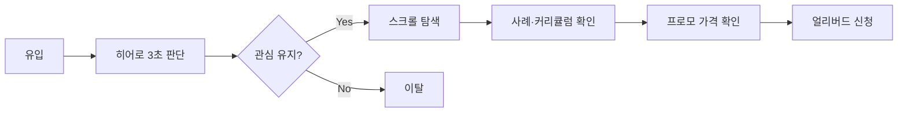
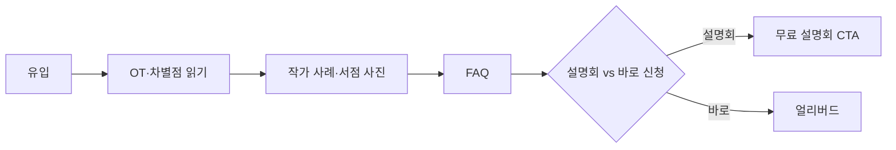
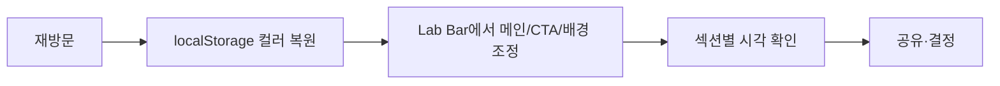

# 다시, 봄 — UX 기획 메모 (Style Lab V4)

> **문서 목적**  
> 랜딩 페이지 UI/UX 흐름 점검·개선 방향 정리 (역사적 V2 기획안 기반)  
> **범위:** `style-lab-v4/` · 테마 i-mylight · Style Lab UI 포함  
> **작성 기준일:** 2026-06-02 (V4 경로 갱신)

---

## 1. 한 줄 정의

| 항목 | 내용 |
|------|------|
| **제품** | 페스트북 시집 출판 강의 「오후의 살롱」 얼리버드 랜딩 페이지 |
| **핵심 목표** | 방문자가 *12주 후 시집 출간* 가치를 이해하고 **얼리버드 신청**까지 도달 |
| **부가 목표** | 무료 설명회 신청, FAQ로 불안 해소 |
| **Style Lab 역할** | 내부·협업용 실시간 스타일 실험 도구 (최종 방문자 UX와 분리 설계 필요) |

---

## 2. 현재 UX 아키텍처 (거시)

페이지는 크게 **4개 레이어**가 겹쳐 동작한다.

```
┌─────────────────────────────────────────────────────────┐
│  Layer A · Lab Bar (sticky)                             │
│  컬러(메인/CTA/배경) · Motion · 접기/FAB                │
├─────────────────────────────────────────────────────────┤
│  Layer B · Glass Nav (fixed, Lab Bar 아래)              │
│  섹션 앵커 · 얼리버드 CTA                               │
├─────────────────────────────────────────────────────────┤
│  Layer C · 콘텐츠 스크롤 스토리 (18개 블록)              │
│  신뢰 → 공감 → 증거 → 커리큘럼 → 전환                   │
├─────────────────────────────────────────────────────────┤
│  Layer D · 모션 시스템 (전역)                           │
│  히어로 입장 · 스크롤 reveal · 카운트업 · (일부 미동작)  │
└─────────────────────────────────────────────────────────┘
```

**레이어 간 충돌 포인트**

- Lab Bar + Nav가 모두 상단을 차지 → 앵커 스크롤 시 제목이 가려질 수 있음 (`scroll-margin` 미설정)
- Lab Bar 접힘 시 FAB(우상단)와 Nav CTA가 같은 시선 영역을 경쟁
- 모션 ON 시 히어로 첫 인상이 1.4초+ 지연 → 전환 버튼 노출도 늦어짐

---

## 3. 사용자 시나리오

### 3.1 첫 방문 · 구매 의향 높음 (Primary)



**기대 행동:** 히어로 CTA 또는 Nav CTA → (필요 시 중간 섹션) → `#i-promo` 결제/신청  
**현재 문제:** 히어로 CTA가 `#cta`(자기 자신)를 가리켜 **아무 동작 없음** — Primary 여정의 첫 관문이 막혀 있음

### 3.2 첫 방문 · 신중형 (Consideration)



**기대 행동:** 정보 섹션을 순서대로 읽고 불안을 해소한 뒤 전환  
**현재 문제:** 설명회·프로모 최종 CTA가 `href="#"` — **전환 막단이 미연결**

### 3.3 재방문 · Style Lab 실험자 (Internal)



**기대 행동:** 저장된 팔레트로 즉시 작업 재개, Lab UI는 방해되지 않게 접기  
**현재 양호:** `styleLabV2`, `styleLabV2UiCollapsed` 영속  
**개선 여지:** Motion은 URL만 저장 — 컬러와 설정 방식 불일치

### 3.4 모바일 방문자 (≥50% 가정)

| 데스크톱 | 모바일 |
|----------|--------|
| Nav 4개 섹션 점프 | **Nav 섹션 링크 없음** (CTA만) |
| Lab 칩 직접 조작 | 드롭다운 3개 |
| 3열 pillars | 1열 스크롤 길어짐 |

**핵심 리스크:** 모바일은 **긴 단일 컬럼 + 점프 수단 부재** → 이탈 전에 핵심 증거(사례·가격)까지 도달률 저하 가능

---

## 4. 스크롤 스토리 — 위에서 아래 UX 역할

섹션을 **설득 단계**로 묶으면 다음과 같다. 이후 UI 개선은 이 단계별 역할에 맞춰 진행한다.

| 단계 | 섹션 (순서) | UX 역할 | 현재 강점 | 개선 과제 |
|------|-------------|---------|-----------|-----------|
| **0. 실험** | Lab Bar | 스타일 실험 | 실시간 반영·영속 | 방문자에게는 노이즈 — 기본 접힘·별도 빌드 분리 검토 |
| **1. 후킹** | 히어로 | 3초 가치 제안 + 1차 CTA | 100svh·감성 카피·배경 | CTA self-link, 메타 정보 밀도, scroll 힌트 미동작 가능 |
| **2. 신뢰** | Stats band | 숫자로 신뢰 | 카운트업 | Lab/Nav 가림 없는지 확인 |
| **3. 공감** | OT 미리보기 | “나도 할 수 있나?” | 대화형 인용 | `k-band--*` 무효 클래스, 인용 모션 |
| **4. 가치** | 3 pillars · 영상 · 약속 | 무엇을 얻는가 | 3열 구조 | 영상 플레이스홀더 — 기대치 관리 필요 |
| **5. 차별** | diff | 왜 여기인가 | 5항목 리스트 | 시각 단조로움 |
| **6. 신뢰(인물)** | 진행자 · 작가 사례 | 누가·누가 했는가 | 에디터 카드 | 이미지 404 가능성 |
| **7. 구조** | 커리큘럼 · 시 예시 | 어떻게 진행되는가 | 아코디언 | 길이·정보 계층 |
| **8. 증거** | 서점 · 결제 플로우 | 실제 결과·절차 | 사진 3장 | — |
| **9. 불안 해소** | FAQ | 마지막 저항 제거 | 5개 details | 항목 확장 시 |
| **10. 전환** | 설명회 · 마감 · 프로모 | 행동 촉구 | 가격 pulse | CTA 미연결, 목적지 분산 |

**스토리 아크 요약**

> 후킹 → 숫자 신뢰 → 감정 공감 → 커리큘럼 이해 → 사회적 증거 → FAQ → 가격·긴급성 → 신청

중간(6~8단계)이 길다. **스크롤 피로**를 줄이려면 모바일에서 앵커·스티키 CTA·중간 마이크로 CTA를 검토해야 한다.

---

## 5. 전환(CTA) 체계 진단

### 5.1 CTA 인벤토리

| 위치 | 라벨 | 현재 동작 | 의도 추정 |
|------|------|-----------|-----------|
| Nav | 얼리버드 신청 | JS → `#i-promo` | 빠른 전환 |
| 히어로 | 얼리버드 신청하기 | `#cta` (자기참조) | **버그** |
| 마감 | 얼리버드 신청하기 | `#i-promo` | 감성 후 전환 |
| 프로모 | 얼리버드 신청하기 | `#` 미연결 | **미완** |
| 설명회 | 무료 설명회 신청하기 | `#` 미연결 | **미완** |

### 5.2 개선 원칙 (CTA)

1. **단일 주 전환:** 모든 「얼리버드」→ 동일 목적지 (`#i-promo` 또는 외부 결제 URL)
2. **보조 전환:** 설명회는 시각·카피로 1차 전환과 명확히 구분 (현재 아웃라인 vs 솔리드 — 방향은 맞음)
3. **히어로 예외 없음:** 첫 화면 CTA는 반드시 스크롤 또는 외부 링크 동작
4. **모바일:** Nav에 섹션 링크가 없으므로 **하단 스티키 CTA** 또는 햄버거 메뉴로 보완

---

## 6. 내비게이션 & 공간 UX

### 6.1 고정 요소 스택

```
viewport top
  └─ Lab Bar     (--lab-bar-h, 44~120px)
  └─ Glass Nav   (~52px)
  └─ [콘텐츠]
```

**필수 개선:** `[id]` 섹션에 `scroll-margin-top: calc(var(--lab-bar-h) + 52px + 8px)` 적용

### 6.2 Nav 순서 vs 문서 순서

| Nav 메뉴 | 문서 등장 순서 |
|----------|----------------|
| 커리큘럼 | 10번째 |
| 작가 | 9번째 |
| 진행자 | 8번째 |
| FAQ | 14번째 |

**권장:** Nav 순서를 **문서 흐름과 일치** (진행자 → 작가 → 커리큘럼 → FAQ) — 사용자 멘탈 모델과 앵커 이동 방향 통일

### 6.3 Lab Bar UX (협업 도구 관점)

| 항목 | 현재 | 개선 방향 |
|------|------|-----------|
| 기본 상태 | 펼침 | 프로덕션 배포 시 **기본 접힘** 또는 Lab 제거 빌드 |
| 컬러 편집 | 더블클릭 | 툴팁·컨텍스트 메뉴로 **발견성** 확보 |
| 모바일 | 드롭다운 3개 | Lab 사용 빈도 낮으면 모바일에서 Lab 축소 |
| FAB vs CTA | 우상단 겹침 | FAB 위치 조정 또는 접힘 시 Nav CTA와 간격 확보 |

---

## 7. 모션 · 인터랙션 정책

| 정책 | 권장 |
|------|------|
| 첫 방문 히어로 | CTA·핵심 카피는 **0.6s 이내** 노출 (현재 최대 1.4s 지연 검토) |
| 스크롤 reveal | 정보 섹션에만 적용, 전환 섹션(프로모)은 즉시 표시 |
| `prefers-reduced-motion` | 유지 (접근성) |
| Motion 설정 영속 | URL + localStorage 통합 검토 |
| `data-dir` vs `data-theme` | V2는 `data-theme`만 사용 → 히어로 줌·scroll 펄스 **수리 필요** |

---

## 8. 핵심 마찰점 우선순위

### P0 — 전환 차단 (즉시)

- [ ] 히어로 CTA `href="#cta"` → `#i-promo` 또는 결제 URL
- [ ] 프로모·설명회 CTA 실제 링크 연결
- [ ] 앵커 `scroll-margin-top` (Lab Bar + Nav 오프셋)

### P1 — 탐색·이탈 (1차 UI 패스)

- [ ] 모바일 섹션 내비 (햄버거 / 하단 탭 / 스티키 CTA)
- [ ] Nav 메뉴 순서 ↔ 문서 순서 정렬
- [ ] `motion.css` ↔ `data-theme` 정합 (히어로 줌·scroll 힌트)
- [ ] 누락 이미지 에셋 (`images/`)

### P2 — 완성도 (섹션별 UI 패스)

- [ ] 10분 영상: 플레이스홀더 vs 임베드 — 기대치 명시
- [ ] OT `k-band` 클래스 정리 또는 V2 스타일 정의
- [ ] 컬러 Lab 더블클릭 편집 힌트
- [ ] 컬러 패널 포커스 트랩·`aria-modal` (접근성)

### P3 — 장기

- [ ] Lab UI 분리 빌드 (방문자용 / 스타일 실험용)
- [ ] 전환율·스크롤 깊이 측정 (GA4 등)
- [ ] A/B: 히어로 CTA 카피·프로모 위치

---

## 9. 위→아래 개선 로드맵 (작업 순서)

이후 UI/UX 작업은 아래 Phase 순서를 따른다. **각 Phase 완료 시 체크리스트로 회귀 테스트.**

| Phase | 대상 | UX 목표 | 완료 기준 |
|-------|------|---------|-----------|
| **0** | 전역·CTA·앵커 | 전환 경로 뚫기 | 모든 CTA 동작, 앵커 가림 없음 |
| **1** | Lab Bar + Nav | 상단 레이어 정리 | 모바일/데스크톱 탐색 가능, FAB·CTA 충돌 해소 |
| **2** | 히어로 + Stats | 3초 후킹·신뢰 | CTA 즉시 동작, 메타·계층 정돈, 모션 타이밍 조정 |
| **3** | OT ~ diff | 공감·가치 전달 | 인용·pillars·영상 UX, 밴드 리듬 |
| **4** | 진행자 ~ 커리큘럼 | 신뢰·구조 | 카드·아코디언·이미지, 모바일 스캔 용이 |
| **5** | FAQ ~ 프로모 | 전환 마무리 | FAQ 확장, 설명회/얼리버드 시각 위계, 가격 강조 |
| **6** | 푸터 + 접근성 | 마무리·준수 | 키보드·스크린리더, reduced-motion |

---

## 10. 섹션별 UX 점검 질문 (Phase 작업 시 사용)

각 섹션 UI를 손댈 때 아래 질문에 답한다.

1. **3초 테스트:** 스크롤 없이 핵심 메시지가 읽히는가?
2. **다음 행동:** 이 섹션을 읽은 뒤 사용자가 무엇을 해야 하는가? (스크롤 / CTA / 없음)
3. **모바일 엄지존:** CTA·인터랙션이 한 손으로 닿는가?
4. **고정 헤더:** 제목·첫 줄이 Nav에 가리지 않는가?
5. **모션 OFF:** `?motion=off`에서도 정보 손실 없는가?
6. **Lab Bar 접힘:** 접힌 상태가 “깨끗한 LP”처럼 보이는가?

---

## 11. 열린 결정 사항 (Stakeholder 확인 필요)

| # | 질문 | 선택지 |
|---|------|--------|
| 1 | Lab Bar 최종 배포 시 | A) 항상 포함 B) 기본 접힘 C) 방문자 빌드에서 제거 |
| 2 | 얼리버드 CTA 목적지 | A) `#i-promo` 스크롤 B) 외부 결제 페이지 C) 둘 다(위치별) |
| 3 | 모바일 내비 | A) 햄버거 B) 하단 스티키 CTA만 C) 하단 섹션 탭 |
| 4 | 10분 영상 | A) 당분간 플레이스홀더 유지 B) 섹션 축소 C) 임베드 필수 |
| 5 | 히어로 CTA 클릭 시 | A) 프로모로 스크롤 B) 바로 결제 C) 설명회 모달 |

---

## 12. 참고 파일

| 파일 | 역할 |
|------|------|
| `index.html` | 섹션 구조·CTA·Lab Bar 마크업 |
| `site-nav.js` / `site-nav.css` | Glass Nav·스크롤 CTA |
| `color-lab.js` / `color-lab.css` | 컬러 실험·Lab UI |
| `motion.js` / `motion.css` | 입장·reveal 애니메이션 |
| `theme.css` / `base.css` | 마이라이트 비주얼·레이아웃 |
| `../style-lab/notes.md` § V2 | 기술 스펙·시드 컬러 |

---

## 13. 다음 액션

1. **Stakeholder:** §11 열린 결정 5항목 확인  
2. **Phase 0 착수:** CTA·앵커 오프셋 수정 (전역, 섹션 UI 전)  
3. **Phase 1:** Lab Bar + Nav — 사용자가 지정한 “위에서부터”의 첫 UI 패스

---

*이 문서는 섹션별 상세 UI 스펙이 아닌 **거시 UX 흐름 기획서**이다. Phase별 와이어·컴포넌트 스펙은 해당 Phase 착수 시 섹션 단위로 분리 작성한다.*
